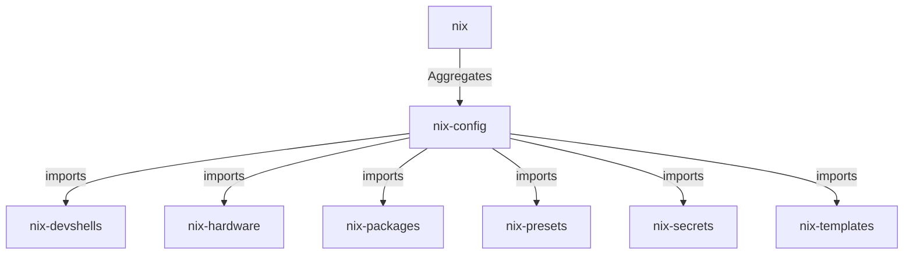

# Workspace Discovery (Auto-generated)
Last Synced: Thu 05 Mar 2026 19:46:47 GMT

## Structure: Meta-Repo (Modular Monorepo)
This workspace is managed as a **Meta-repo**. It uses Git submodules to aggregate multiple independent flakes into a unified coding environment.

### Flake Hierarchy

### Key Repositories
| Repo | Role |
| :--- | :--- |
| **nix-config** | Primary system consumer / Host definitions |
| **nix-presets** | Reusable service and desktop bundles |
| **nix-hardware** | Device-specific configurations |

## Workload Profiles (Specialisations)
The system supports multiple operational modes to balance performance and capability.
See the [Workload Profile Matrix](file:///home/martin/Develop/github.com/kleinbem/nix/.agent/workload_profiles.md) for a detailed breakdown of services per mode.
